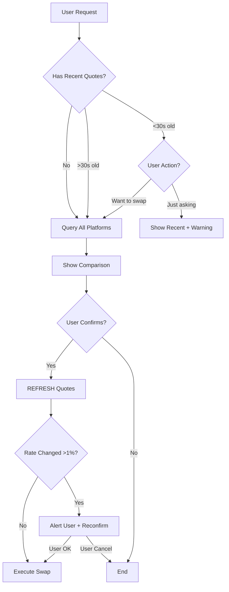

# Cross-Chain Price Comparison

Compare cross-chain token swap quotes from multiple platforms to help users find the most cost-effective exchange option.

## ⚡ Real-Time Quotes - No Caching!

**CRITICAL: Always query fresh, real-time quotes for every request.**

- ✅ Each user request triggers new API calls to all platforms
- ✅ Quotes are refreshed before executing any swap
- ✅ Rate changes are detected and users are alerted
- ❌ Never cache or reuse old quote data
- ❌ Never assume rates remain stable

**Why this matters:**
Cross-chain exchange rates fluctuate based on liquidity, network congestion, and market conditions. Using stale quotes can result in:

- Unexpected slippage
- Failed transactions
- User receiving less than expected
- Poor user experience

## 🎯 Purpose

This skill helps users make informed decisions by comparing quotes from all available swap platforms:

- **Bridgers DEX**: Smart contract-based DEX aggregator
- **Omnibridge**: Platform托管 cross-chain swap service

## 🔍 What to Compare

### Key Metrics

1. **Exchange Rate**: Amount received per unit sent
2. **Total Output**: Final amount user receives
3. **Fees**: Platform fees, network fees, gas costs
4. **Net Profit**: Which platform gives more tokens after all fees
5. **Limits**: Min/max swap amounts
6. **Speed**: Estimated completion time
7. **Security**: Smart contract vs platform托管

### Comparison Table Format

```
Platform     | Output Amount | Fee Rate | Network Fee | Total Fee | Net Rate
-------------|---------------|----------|-------------|-----------|----------
Bridgers     | 99.5 USDT     | 0.3%     | 0.2 USDT    | 0.5 USDT  | 0.995
Omnibridge   | 99.2 USDT     | 0.5%     | 0.3 USDT    | 0.8 USDT  | 0.992
✅ BEST      | Bridgers      | +0.3 USDT more
```

## 📋 Comparison Workflow

### Step 1: Understand User Request

Extract these parameters:

- **Source token**: e.g., USDT
- **Source chain**: e.g., BSC
- **Destination token**: e.g., USDT
- **Destination chain**: e.g., ETH
- **Amount**: e.g., 100 USDT

### Step 2: Prepare Platform-Specific Parameters

#### For Bridgers DEX

Bridgers uses **token contract addresses** and **chain names**:

```javascript
// Get token list to find contract addresses
const tokens = await bridgers_get_tokens();

// Find source token on source chain
const sourceToken = tokens.find((t) => t.symbol === "USDT" && t.chain === "BSC");

// Find destination token on destination chain
const destToken = tokens.find((t) => t.symbol === "USDT" && t.chain === "ETH");

// Prepare Bridgers quote params
const bridgersParams = {
  fromTokenAddress: sourceToken.address, // Contract address
  toTokenAddress: destToken.address,
  fromTokenChain: "BSC",
  toTokenChain: "ETH",
  fromTokenAmount: "100000000000000000000", // WITH decimals
  userAddress: userWalletAddress,
};
```

**CRITICAL: Amount with Decimals**

- USDT on BSC has 18 decimals
- 100 USDT = "100000000000000000000" (100 + 18 zeros)
- Use token's `decimals` field from token list

#### For Omnibridge

Omnibridge uses **coin codes** in `"TOKEN(CHAIN)"` format:

```javascript
// Get coin list for source chain
const bscCoins = await omnibridge_get_coins({ mainNetwork: "BSC" });

// Find source coin
const sourceCoin = bscCoins.find((c) => c.coinCode === "USDT" && c.mainNetwork === "BSC");

// Get coin list for destination chain
const ethCoins = await omnibridge_get_coins({ mainNetwork: "ETH" });

// Find destination coin
const destCoin = ethCoins.find((c) => c.coinCode === "USDT" && c.mainNetwork === "ETH");

// Construct coin codes
const depositCoinCode = `${sourceCoin.coinCode}(${sourceCoin.mainNetwork})`; // "USDT(BSC)"
const receiveCoinCode = `${destCoin.coinCode}(${destCoin.mainNetwork})`; // "USDT(ETH)"

// Prepare Omnibridge quote params
const omnibridgeParams = {
  depositCoinCode: "USDT(BSC)",
  receiveCoinCode: "USDT(ETH)",
  depositCoinAmt: "100", // WITHOUT decimals
};
```

**CRITICAL: Amount WITHOUT Decimals**

- Omnibridge expects raw amount
- 100 USDT = "100" (not "100000000000000000000")

### Step 3: Get Quotes from All Platforms

#### Query Bridgers

```javascript
const bridgersQuote = await bridgers_get_quote({
  fromTokenAddress: "0x55d398326f99059fF775485246999027B3197955", // USDT on BSC
  toTokenAddress: "0xdAC17F958D2ee523a2206206994597C13D831ec7", // USDT on ETH
  fromTokenAmount: "100000000000000000000", // 100 USDT with decimals
  fromTokenChain: "BSC",
  toTokenChain: "ETH",
  userAddress: "0xUserAddress",
});

// Response includes:
// - expectedOutput: "99500000000000000000" (99.5 USDT with decimals)
// - minOutput: "99005000000000000000"
// - platformFee: "0.30%"
// - chainFee: "200000000000000000" (0.2 USDT)
// - depositMin: "10000000000000000000"
// - depositMax: "1000000000000000000000000"
```

#### Query Omnibridge

```javascript
const omnibridgeQuote = await omnibridge_get_quote({
  depositCoinCode: "USDT(BSC)",
  receiveCoinCode: "USDT(ETH)",
  depositCoinAmt: "100", // WITHOUT decimals
});

// Response includes:
// - exchangeRate: "0.992"
// - serviceFeeRate: "0.005" (0.5%)
// - networkFee: "0.3"
// - receiveCoinAmt: "99.2" (expected output)
// - minLimit: "10"
// - maxLimit: "100000"
```

### Step 4: Normalize Data for Comparison

Convert all amounts to the same format (human-readable, without decimals):

```javascript
// Bridgers: Convert from decimals to readable
const bridgersOutput = parseFloat(bridgersQuote.expectedOutput) / Math.pow(10, 18);
const bridgersFee = parseFloat(bridgersQuote.chainFee) / Math.pow(10, 18);
const bridgersFeeRate = parseFloat(bridgersQuote.platformFee.replace("%", "")) / 100;

// Omnibridge: Already in readable format
const omnibridgeOutput = parseFloat(omnibridgeQuote.receiveCoinAmt);
const omnibridgeFee = parseFloat(omnibridgeQuote.networkFee);
const omnibridgeFeeRate = parseFloat(omnibridgeQuote.serviceFeeRate);

// Calculate net rates
const bridgersNetRate = bridgersOutput / 100; // 99.5 / 100 = 0.995
const omnibridgeNetRate = omnibridgeOutput / 100; // 99.2 / 100 = 0.992
```

### Step 5: Compare and Rank

```javascript
const comparison = [
  {
    platform: "Bridgers DEX",
    output: bridgersOutput,
    feeRate: bridgersFeeRate,
    networkFee: bridgersFee,
    totalFee: bridgersFee + 100 * bridgersFeeRate,
    netRate: bridgersNetRate,
    minAmount: parseFloat(bridgersQuote.depositMin) / Math.pow(10, 18),
    maxAmount: parseFloat(bridgersQuote.depositMax) / Math.pow(10, 18),
  },
  {
    platform: "Omnibridge",
    output: omnibridgeOutput,
    feeRate: omnibridgeFeeRate,
    networkFee: omnibridgeFee,
    totalFee: omnibridgeFee + 100 * omnibridgeFeeRate,
    netRate: omnibridgeNetRate,
    minAmount: parseFloat(omnibridgeQuote.minLimit),
    maxAmount: parseFloat(omnibridgeQuote.maxLimit),
  },
];

// Sort by output amount (highest first)
comparison.sort((a, b) => b.output - a.output);

const best = comparison[0];
const difference = best.output - comparison[1].output;
```

### Step 6: Present Results to User

**Always show:**

1. **Query timestamp** - When these quotes were fetched
2. **Comparison table** with all platforms
3. **Best option** clearly marked
4. **Savings amount** (difference from best to worst)
5. **Important notes** about each platform
6. **Validity warning** - Quotes may change before execution
7. **Ask user to confirm** which platform to use

**Example Output:**

```
📊 Cross-Chain Swap Quote Comparison

Swapping: 100 USDT (BSC) → USDT (ETH)
⏰ Quotes fetched at: 2026-04-01 12:30:45 UTC (just now)

┌─────────────┬──────────────┬──────────┬─────────────┬───────────┬──────────┐
│ Platform    │ You Receive  │ Fee Rate │ Network Fee │ Total Fee │ Net Rate │
├─────────────┼──────────────┼──────────┼─────────────┼───────────┼──────────┤
│ ✅ Bridgers │ 99.5 USDT    │ 0.30%    │ 0.2 USDT    │ 0.5 USDT  │ 99.5%    │
│ Omnibridge  │ 99.2 USDT    │ 0.50%    │ 0.3 USDT    │ 0.8 USDT  │ 99.2%    │
└─────────────┴──────────────┴──────────┴─────────────┴───────────┴──────────┘

💰 Best Option: Bridgers DEX
   You save: 0.3 USDT more compared to Omnibridge

⚠️ Note: Exchange rates change constantly. Quotes will be refreshed before execution.

📝 Platform Details:

Bridgers DEX:
  • Type: Smart contract DEX (on-chain)
  • Speed: ~15-30 minutes
  • Limits: 10 - 1,000,000 USDT
  • Security: Non-custodial (you control tokens)

Omnibridge:
  • Type: Platform托管 (send to platform address)
  • Speed: ~10-20 minutes
  • Limits: 10 - 100,000 USDT
  • Security: Custodial (trust platform)

Would you like to proceed with Bridgers DEX?
```

## 🚨 Error Handling

### Platform Unavailable

If one platform returns an error, still show results from available platforms:

```
⚠️ Note: Omnibridge quote failed (Error 914: 接收货币币种不存在)

Showing results from available platforms:

┌─────────────┬──────────────┬──────────┐
│ Platform    │ You Receive  │ Status   │
├─────────────┼──────────────┼──────────┤
│ ✅ Bridgers │ 99.5 USDT    │ ✅ Ready │
│ Omnibridge  │ N/A          │ ❌ Error │
└─────────────┴──────────────┴──────────┘

Proceeding with Bridgers DEX (only available option).
```

### No Platforms Support Pair

```
❌ No platforms support this swap pair:
   100 BTC (Bitcoin) → ETH (Ethereum)

Supported alternatives:
• Try wrapped BTC (WBTC) on ETH instead
• Check individual platform tools for available pairs
```

### Amount Outside Limits

```
⚠️ Amount 5 USDT is below minimum for some platforms:

┌─────────────┬─────────────┬────────────┬────────────┐
│ Platform    │ Your Amount │ Minimum    │ Status     │
├─────────────┼─────────────┼────────────┼────────────┤
│ Bridgers    │ 5 USDT      │ 10 USDT    │ ❌ Too low │
│ Omnibridge  │ 5 USDT      │ 10 USDT    │ ❌ Too low │
└─────────────┴─────────────┴────────────┴────────────┘

Suggestion: Increase amount to at least 10 USDT
```

## 🎯 Best Practices

### 0. Real-Time Query on Every Request 🔄

**MANDATORY: Every time user mentions swap/exchange/compare, query fresh quotes.**

```javascript
// User says: "我想兑换 100 USDT 从 BSC 到 ETH"
// → IMMEDIATELY query both platforms

// User says: "帮我对比一下报价"
// → Query fresh quotes (even if just queried 1 minute ago)

// User says: "现在行情怎么样？"
// → Query fresh quotes and show latest rates

// User says: "用 Bridgers 兑换"
// → REFRESH quotes one more time before executing

// ✅ ALWAYS: Query on every request
const quotes = await compareAllPlatforms(params);

// ❌ NEVER: Reuse old data
const cachedQuotes = lastQuotes; // DON'T DO THIS!
```

**Quote Validity:**

- Consider quotes "stale" after 30 seconds
- Always show timestamp with quotes
- If >30 seconds old, auto-refresh before showing

```javascript
function shouldRefreshQuotes(lastQueryTime) {
  const now = Date.now();
  const age = (now - lastQueryTime) / 1000; // seconds
  return age > 30; // Refresh if older than 30s
}

// Example usage
let lastQuotes = null;
let lastQueryTime = 0;

async function getQuotes(params) {
  if (!lastQuotes || shouldRefreshQuotes(lastQueryTime)) {
    console.log("📡 Fetching fresh quotes from all platforms...");
    lastQuotes = await compareAllPlatforms(params);
    lastQueryTime = Date.now();
  } else {
    console.log(
      "⚠️ Using recent quotes from",
      Math.floor((Date.now() - lastQueryTime) / 1000),
      "seconds ago",
    );
  }

  return {
    ...lastQuotes,
    timestamp: new Date(lastQueryTime).toISOString(),
    age: Math.floor((Date.now() - lastQueryTime) / 1000),
  };
}
```

### 1. Always Compare Before Swapping

```javascript
// ❌ BAD: Directly swap without comparing
await bridgers_get_swap_data(...);

// ✅ GOOD: Compare first, then swap
const comparison = await compareAllPlatforms(...);
const best = selectBestPlatform(comparison);
await confirmWithUser(best);
await executeSwap(best.platform, ...);
```

### 2. Consider All Factors

Not just fees! Also consider:

- **Security model**: Custodial vs non-custodial
- **Speed**: Some platforms are faster
- **Reliability**: Track record and uptime
- **Limits**: Does amount fit within limits?

### 3. Handle Decimal Conversions Carefully

```javascript
// Different platforms use different formats!

// Bridgers: WITH decimals
const bridgersAmount = (100 * Math.pow(10, decimals)).toString();

// Omnibridge: WITHOUT decimals
const omnibridgeAmount = "100";

// Always check token decimals from token list
```

### 4. Refresh Quotes Before Execution ⚠️ CRITICAL

**ALWAYS query fresh quotes - NEVER use cached data!**

Cross-chain exchange rates change constantly. Follow this workflow:

```javascript
// ✅ CORRECT: Query fresh quotes every time
async function handleSwapRequest(params) {
  // Step 1: Get fresh quotes (no caching!)
  const quotes = await compareAllPlatforms(params);
  showToUser(quotes);

  // Step 2: User chooses platform and confirms
  const userChoice = await askUser("Which platform do you want to use?");

  // Step 3: REFRESH quotes before executing (critical!)
  const freshQuotes = await compareAllPlatforms(params);

  // Step 4: Check if rates changed significantly
  const rateChange = Math.abs(freshQuotes[0].output - quotes[0].output) / quotes[0].output;

  if (rateChange > 0.01) {  // >1% change
    showToUser("⚠️ Rates have changed! Updated comparison:");
    showToUser(freshQuotes);
    const reconfirm = await askUser("Rates changed. Still want to proceed?");
    if (!reconfirm) return;
  }

  // Step 5: Execute with fresh data
  await executeSwap(userChoice, freshQuotes);
}

// ❌ WRONG: Using stale data
const quotes = await compareAllPlatforms(...);
// ... 5 minutes later ...
await executeSwap(quotes);  // Rates might have changed!
```

**When to Refresh:**

1. **Every user request**: Each time user asks for swap quotes
2. **Before execution**: Always re-query right before swapping
3. **After errors**: If swap fails, refresh and try again
4. **On user request**: If user says "check again" or "refresh"

**Rate Change Alerts:**

```javascript
// Define significant change threshold
const SIGNIFICANT_CHANGE = 0.01; // 1%

function checkRateChange(oldQuotes, newQuotes) {
  const oldBest = oldQuotes[0].output;
  const newBest = newQuotes[0].output;
  const changePercent = Math.abs(newBest - oldBest) / oldBest;

  if (changePercent > SIGNIFICANT_CHANGE) {
    const direction = newBest > oldBest ? "↑ improved" : "↓ worsened";
    const diff = Math.abs(newBest - oldBest).toFixed(4);

    return {
      changed: true,
      direction,
      diff,
      message: `⚠️ Rate ${direction} by ${diff} tokens (${(changePercent * 100).toFixed(2)}%)`,
    };
  }

  return { changed: false };
}
```

**No Caching Policy:**

- ❌ Do NOT cache quote results
- ❌ Do NOT reuse quotes from previous requests
- ❌ Do NOT assume rates are stable
- ✅ Always query fresh data from APIs
- ✅ Show timestamps on all quotes
- ✅ Warn users if refreshing takes time

### 5. Save Comparison for User Reference

```javascript
// After showing comparison, ask user
"Would you like me to save this comparison for your records?";

// If yes, format as markdown or JSON
const report = formatComparisonReport(comparison);
// User can refer back to why they chose that platform
```

## 🔧 Implementation Checklist

Before presenting comparison to user:

- [ ] Got quotes from ALL available platforms (or handled errors)
- [ ] Quotes are FRESH (just queried, not cached)
- [ ] Included timestamp showing when quotes were fetched
- [ ] Converted all amounts to same format (human-readable)
- [ ] Calculated total fees (platform fee + network fee)
- [ ] Sorted platforms by best output amount
- [ ] Checked amount is within limits for all platforms
- [ ] Formatted comparison table clearly
- [ ] Highlighted best option with ✅
- [ ] Included platform details (security, speed, limits)
- [ ] Added validity warning (rates may change)
- [ ] Asked user to confirm which platform to use

Before executing swap:

- [ ] REFRESH quotes one final time
- [ ] Check if rates changed significantly (>1%)
- [ ] Alert user if rates changed
- [ ] Get user confirmation with updated rates
- [ ] Execute swap with fresh data

## 📡 Real-Time Query Strategy

### Query Triggers

Always query fresh quotes when:

1. ✅ User asks to compare rates
2. ✅ User mentions swap/exchange/convert
3. ✅ User asks "what's the rate" or "how much"
4. ✅ User chooses platform and confirms swap
5. ✅ Previous quotes are >30 seconds old
6. ✅ User says "refresh" or "check again"

### Query Flow



### Implementation Example

```typescript
class QuoteManager {
  private lastQuotes: any = null;
  private lastQueryTime: number = 0;
  private STALE_THRESHOLD_MS = 30 * 1000; // 30 seconds

  async getQuotes(params: SwapParams, forceRefresh = false): Promise<QuoteComparison> {
    const now = Date.now();
    const age = now - this.lastQueryTime;

    if (forceRefresh || !this.lastQuotes || age > this.STALE_THRESHOLD_MS) {
      console.log(
        `📡 Fetching fresh quotes (${forceRefresh ? "forced" : age > this.STALE_THRESHOLD_MS ? "stale" : "first query"})`,
      );

      this.lastQuotes = await this.queryAllPlatforms(params);
      this.lastQueryTime = now;
    } else {
      console.log(`⏱️  Using recent quotes from ${Math.floor(age / 1000)}s ago`);
    }

    return {
      ...this.lastQuotes,
      queriedAt: new Date(this.lastQueryTime).toISOString(),
      ageSeconds: Math.floor(age / 1000),
      isStale: age > this.STALE_THRESHOLD_MS,
    };
  }

  private async queryAllPlatforms(params: SwapParams): Promise<any> {
    const [bridgersQuote, omnibridgeQuote] = await Promise.allSettled([
      this.queryBridgers(params),
      this.queryOmnibridge(params),
    ]);

    return this.normalizeAndCompare(bridgersQuote, omnibridgeQuote);
  }

  async refreshBeforeSwap(params: SwapParams): Promise<QuoteComparison> {
    console.log("🔄 Refreshing quotes before swap execution...");
    return this.getQuotes(params, true); // Force refresh
  }

  checkSignificantChange(
    oldQuotes: QuoteComparison,
    newQuotes: QuoteComparison,
  ): {
    changed: boolean;
    message?: string;
  } {
    const THRESHOLD = 0.01; // 1%
    const oldBest = oldQuotes.platforms[0].output;
    const newBest = newQuotes.platforms[0].output;
    const changeRatio = Math.abs(newBest - oldBest) / oldBest;

    if (changeRatio > THRESHOLD) {
      const direction = newBest > oldBest ? "improved ↑" : "worsened ↓";
      const diff = Math.abs(newBest - oldBest).toFixed(4);
      const percent = (changeRatio * 100).toFixed(2);

      return {
        changed: true,
        message: `⚠️ Exchange rate ${direction} by ${diff} tokens (${percent}%)`,
      };
    }

    return { changed: false };
  }
}

// Usage in skill
const quoteManager = new QuoteManager();

// When user asks for comparison
const quotes = await quoteManager.getQuotes(params);
showToUser(quotes);

// When user confirms swap
const userChoice = await askUser("Which platform?");
const freshQuotes = await quoteManager.refreshBeforeSwap(params);
const change = quoteManager.checkSignificantChange(quotes, freshQuotes);

if (change.changed) {
  showToUser(change.message);
  const ok = await askUser("Rate changed. Still proceed?");
  if (!ok) return;
}

await executeSwap(userChoice, freshQuotes);
```

## 🎓 Example: Complete Comparison Flow

```javascript
// User asks: "Compare swap rates for 100 USDT from BSC to ETH"

// Step 1: Get user's wallet address
const wallet = await eth_get_address({ accountIndex: 0 });

// Step 2: Prepare Bridgers params
const bridgersTokens = await bridgers_get_tokens();
const usdtBsc = bridgersTokens.find(t => t.symbol === "USDT" && t.chain === "BSC");
const usdtEth = bridgersTokens.find(t => t.symbol === "USDT" && t.chain === "ETH");

// Step 3: Prepare Omnibridge params
const bscCoins = await omnibridge_get_coins({ mainNetwork: "BSC" });
const ethCoins = await omnibridge_get_coins({ mainNetwork: "ETH" });
const usdtBscCoin = bscCoins.find(c => c.coinCode === "USDT");
const usdtEthCoin = ethCoins.find(c => c.coinCode === "USDT");

// Step 4: Get quotes in parallel
const [bridgersQuote, omnibridgeQuote] = await Promise.allSettled([
  bridgers_get_quote({
    fromTokenAddress: usdtBsc.address,
    toTokenAddress: usdtEth.address,
    fromTokenAmount: (100 * Math.pow(10, usdtBsc.decimals)).toString(),
    fromTokenChain: "BSC",
    toTokenChain: "ETH",
    userAddress: wallet.address
  }),
  omnibridge_get_quote({
    depositCoinCode: `USDT(BSC)`,
    receiveCoinCode: `USDT(ETH)`,
    depositCoinAmt: "100"
  })
]);

// Step 5: Compare and present
const comparison = buildComparison(bridgersQuote, omnibridgeQuote);
presentToUser(comparison);

// Step 6: Wait for user decision
const userChoice = await askUser("Which platform would you like to use?");

// Step 7: Execute swap with chosen platform
if (userChoice === "Bridgers") {
  await executeBridgersSwap(...);
} else if (userChoice === "Omnibridge") {
  await executeOmnibridgeSwap(...);
}
```

## 📚 Related Skills

- **bridgers_exchange**: Execute swaps on Bridgers DEX
- **omnibridge_swap**: Execute swaps on Omnibridge
- **wallet_custody_manager**: Manage wallet addresses

## ⚠️ Important Warnings

1. **Quotes are time-sensitive**: Exchange rates change constantly
2. **Gas fees vary**: Network congestion affects costs
3. **Slippage can occur**: Final amount may differ slightly
4. **Platform availability**: Some platforms may be temporarily unavailable
5. **Supported pairs differ**: Not all platforms support all token pairs

## 🎯 Success Criteria

A successful comparison should:

1. ✅ Show quotes from all available platforms
2. ✅ Clearly identify the best option
3. ✅ Explain the differences between platforms
4. ✅ Help user make an informed decision
5. ✅ Handle errors gracefully
6. ✅ Validate amounts are within limits
7. ✅ Present data in an easy-to-understand format

---

**Remember**: This skill is about comparison and decision-making. After user decides, use the appropriate platform skill (bridgers_exchange or omnibridge_swap) to execute the actual swap.
